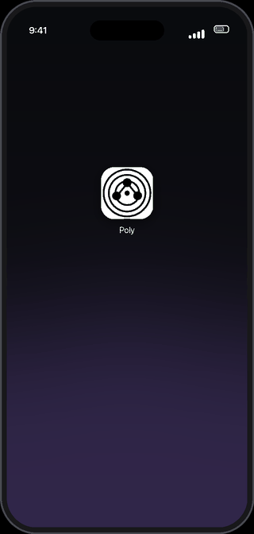

# C1M (Duo)

**Claude and ChatGPT check each other with one button — through your own apps, no server, no API key,
no new subscription. Nothing like it exists anywhere else.**

**Claude и ChatGPT проверяют друг друга по одной кнопке — через ваши собственные приложения, без
сервера, без API-ключа, без новой подписки. Такого в мире нет.**

C1M is the source of **Duo** and **Trio**, two iPhone shortcuts from the
[Poly A1](https://polyhelper.ai/) family. They run on the ChatGPT and Claude apps already on your
phone and on the subscriptions you already pay for, through the Shortcuts actions those apps publish
themselves. Nothing goes through a server of ours — there isn't one.

[](LICENSE)


<p align="center">
  
</p>

## Duo and Trio

- **Duo** — the pair. ChatGPT answers, Claude checks and corrects it, and you get one answer on the
  screen and in the clipboard, in about a minute. That is the default mode, **Critique**; ten more
  modes (debate, side by side, dispute map, decision, …) are one tap away. Spends 1–4 messages from
  your own ChatGPT and Claude plans per run — no keys at all.
- **Trio** — Duo plus a third voice from a third company. After Claude's check, a free AI names
  only the errors and gaps both of them missed; its words come as a separate block under Claude's
  answer. It runs on any **free** key — Google AI Studio (Gemini), OpenRouter (dozens of free
  models) or Groq — or several of them: Trio tries every key and every free model until one
  answers. Keys are never inside the shortcut: asked once on the first run and kept in your iCloud
  Drive (`Shortcuts/poly-key.txt`).

## Install in 60 seconds

1. On your iPhone, open [`releases/`](releases) and pick your language — `en`, `es`, `pt`, `ru` or `uk`.
2. Tap **`Duo.shortcut`** (or **`Trio.shortcut`**) → **Add Shortcut**.
3. Run it once and tap **Always Allow** when it asks about ChatGPT, Claude and the clipboard.

The same signed files are on [polyhelper.ai/duo](https://polyhelper.ai/duo/). Keep the file name
`Duo.shortcut`: the name in Shortcuts comes from it, and «another mode — same question» finds the
shortcut by that name.

## Requirements

- iPhone on **iOS 18 or later** (iPad on iPadOS 18+ is expected to work, untested).
- The **ChatGPT** and **Claude** apps, installed and signed in.
- A **paid Claude plan** — on a free account the Claude action answers "model isn't available".
- For **Trio**: any free key (no card) — [Google AI Studio](https://aistudio.google.com/apikey),
  [OpenRouter](https://openrouter.ai/keys) or [Groq](https://console.groq.com/keys); several keys,
  one per line, make it sturdier. On the first run iPhone asks for permission 4–5 times — tap
  **Allow** each time.
- Don't touch the screen while it runs — that cancels the run on Apple's platform.

Docs in ten languages: [English](docs/en/install.md) · [العربية](docs/ar/install.md) · [Deutsch](docs/de/install.md) · [Español](docs/es/install.md) · [Français](docs/fr/install.md) · [हिन्दी](docs/hi/install.md) · [日本語](docs/ja/install.md) · [Português](docs/pt/install.md) · [Русский](docs/ru/install.md) · [中文](docs/zh/install.md)

To build from source you need macOS (the `shortcuts` CLI signs the files) and Python 3.9+ — see
[Build from source](#build-from-source).

---

*In the sources the main shortcut is still called **Poly** — `tools/build.sh` writes
`dist/<lang>/Poly.shortcut`. **Duo** is the same shortcut released under its own name, with «Poly»
as the shortcut's name changed to «Duo» in titles, menus, help and journal file names. The rest of
this page describes it as Poly.*

## Why a pair

One model answering alone is confident about everything, including the parts it gets wrong. A
second model reading the first one's answer catches factual slips, missing angles and
overconfident claims — and it costs one extra message.

Poly runs on the Shortcuts actions the ChatGPT and Claude apps publish themselves, so a run
spends messages from your own plan, exactly like asking the question by hand.

**Use it when the answer matters.** Not for "what's the capital of France" — for the question
where being wrong is expensive: a contract clause, a diagnosis you're about to act on, a supplier,
a treatment, a piece of code going to production, a letter you can't unsend. People already do
this by hand — asking one AI, then another, then squinting at two tabs. Poly is that habit
without the tabs.

**And it keeps the argument.** When the two models disagree, Poly says so instead of averaging
them into one smooth paragraph: what each one claimed, which part is checkable, what to verify.
Two AIs agreeing is a weak signal — they read the same internet — so agreement is never presented
as proof.

```
your question
     │
     ├──→  ChatGPT drafts the answer
     │
     └──→  Claude verifies it and fixes what's wrong
                    │
                    └──→  one final answer  →  screen · clipboard · journal
```

That's **Critique**, the default mode and the only one you need on the first day. Ten other modes
put the two models against each other in different ways — a debate, a side-by-side, a map of
where they disagree — and they stay out of your way until you want them.

<details>
<summary>All eleven modes</summary>

| Mode | What happens | Cost |
|---|---|---|
| ⚖️ **Critique** | ChatGPT answers, Claude verifies and delivers the improved final. Your default. | 2 messages |
| 🩺 **Advisor** | Claude reviews *your own* text without rewriting it: verdict, strongest objection first. | 1 message |
| 👀 **Side by side** | Both answer independently, answers shown next to each other, nothing blended. | 2 messages |
| 🔀 **Synthesis** | Both answer blind, then one answer anchors the assembly and the other adds only what's missing. | 3 messages |
| 🧭 **Auto** | Not sure which mode fits? One classification call recommends one. | 1 + the mode |
| ⚔️ **Decision** | Fast view vs cautious view, then a referee: first steps, risks, confidence. | 3 messages |
| 🗺 **Dispute map** | Where the two agree, where they disagree, what is checkable — no verdict imposed on you. | 3 messages |
| 🥊 **Debate** | Draft → opponent attacks it → revision → judge. For the hard ones. | 4 messages |
| ❓ **Clarify** | The model asks you what's missing first, then answers. | 2 messages |
| 🎨 **Image** | Both draw the same brief blind as vector art; you get a gallery and pick. | 2–3 messages |
| ➕ **Delta** | Claude anchors, ChatGPT returns only what it would add. A cheap stand-in for Synthesis. | 2 messages |
| ℹ️ **What is Poly** | Built-in help, right inside the run. | free |

Five everyday modes sit in the main menu; the rest live one tap away under **📂 More…** The ✉
badge on each entry shows the price before you choose. Which mode for which task:
[docs/en/recipes.md](docs/en/recipes.md).

</details>

## Trio — a third voice on a free key

**Trio** is the Critique pair plus a third AI from a third company. ChatGPT answers, Claude checks
and writes the final answer — exactly as in Poly — and then a third model reads the question and
both answers and names **only the errors and gaps both of them missed**. If there are none, it says
so in one line («Agree with the final answer»). Its words come back as a separate block under
Claude's answer, never merged into it, and end with a confidence line.

```
ChatGPT answers → Claude checks → third voice (Gemini / OpenRouter / Groq): only what both missed
```

- **Free.** The third voice runs on free keys, no card: Google AI Studio (Gemini Flash), OpenRouter
  (its `:free` models — NVIDIA Nemotron, Qwen, Gemma and OpenRouter's free router) and Groq. Save one
  or several; Trio walks every model of every key until one answers — a busy model or a spent daily
  limit moves on to the next, a key with no money or an invalid key is skipped.
- **The key stays out of the shortcut.** Trio asks for it once and saves it in iCloud Drive →
  Shortcuts → `poly-key.txt`. Sharing `Trio.shortcut` never shares a key.
- **Errors in plain words.** Only if every key and model failed does the block list what each one
  answered — no money left (402), limit (429), overloaded (503), invalid key (401) — and what to do.
  Claude's answer is already in the clipboard before the third voice is asked.
- File: `dist/<lang>/Trio.shortcut` (en, es, pt, ru, uk). Getting the key: [docs/en/install.md](docs/en/install.md#trio--the-third-voice-free-key).

The pair still needs no key at all — Trio is the one place where a free key buys a third company.

## Companions

Small single-purpose shortcuts that share the same engine:

- **Poly Voice** — tap, dictate, hear the final answer read back.
- **Poly Photo** — share a photo or PDF; the text is recognized on device, then answered.
- **Poly Quiet** — the Critique pipeline with no screens at all: clipboard and journal only.
- **Poly Compress** — shrink a long text with Apple's on-device model before the pair sees it.
  This one needs Apple Intelligence hardware (A17 Pro / M-series or newer); nothing else does.
- **Poly Multi** — the pair plus any other AIs you have, semi-manually: Poly writes the prompt,
  walks you through the apps and merges everything into one document; you paste, send and copy.
  Roughly half the work of doing it by hand. Ships alongside the core.

> **Want the full council rather than a pair?** Poly is the pocket edition of a larger method:
> **PolyHelper** asks up to ten AIs and merges them into one document with the disagreements kept —
> free, nothing to install, on any device. Poly Multi already merges by its canon.
> → ask whoever gave you this folder for **PolyHelper C1**.

## Android — experimental, and we could use your help

Poly proper is an iPhone shortcut. But the same idea runs on Android through **Tasker** and the
clipboard, because neither Claude nor ChatGPT publishes an action there that another app can call.
Tasker prepares the prompt, opens each app in turn and picks the answer up the moment you copy it;
you do the tapping, it does the choreography and the merge.

**It is built and structurally verified, and nobody has run it on a real phone yet.** That is the
honest status, and it is exactly where you can help: import the clipboard relay, ask it one
question, and tell us what happened at info@polyhelper.ai — [android/](android/) has the files
and the guide.

## Languages

English is the base language. Everything a user sees — menus, notifications, prompts, journal
entries, docs — comes from `locales/<lang>/`, so a new language is a folder, never a fork of the
code.

Prompts are deliberately shared across all languages. The models read them, not you, and English
works best there — every locale uses `locales/en/prompts/` by default, and any language may
override a single prompt by dropping its own file into `locales/<lang>/prompts/` if it ever needs to.

All ten are built and verified against their sources — `python3 tools/verify.py` checks that every
shipped shortcut is what the locale files produce, and that every kit matches.

| Language | Locale | | Language | Locale |
|---|---|---|---|---|
| English (base) | `en` | | 日本語 | `ja` |
| العربية | `ar` | | Português | `pt` |
| Deutsch | `de` | | Русский | `ru` |
| Español | `es` | | 中文 | `zh` |
| Français | `fr` | | हिन्दी | `hi` |

Verified against the source files is not the same as run on a phone. Two of the ten have been
through a live iPhone with paid accounts, end to end, every mode; the other eight are built from
the same sources and machine-checked against them, but nobody has used them on a phone yet — if
you install one, telling us what broke is the most useful thing you can do.

How the languages are built: [BUILD.md](BUILD.md).

The *answer* always comes back in the language of your question, whichever locale you install —
the prompts instruct both models to follow the user's language.

## Privacy and cost

Your question goes to the two apps you already use, and the result stays on your phone. There is
no C1M server for it to reach — nothing is collected, and there is nothing to sign up for. The
journal (`Poly-journal.md`) is a plain text file in your own iCloud Drive; delete the journal
action or the file if you don't want a history. A paid iCloud plan is not required — without
iCloud the answer still reaches your screen and clipboard, only the journal is skipped.

Message consumption comes out of your ChatGPT and Claude subscriptions, 1 to 4 per run, from the
same allowance as your normal chats — and the ✉ badge in the menu tells you the price before you
pick a mode. The code is open source under the Apache License 2.0 — see [LICENSE](LICENSE).

## Limitations

Worth knowing before you install:

- **iPhone only, iOS 18 or later.** iPad is expected to work on iPadOS 18+, but it is untested.
- **A paid Claude plan is required.** On a free account the Claude action can come back with
  "model isn't available."
- **A run takes about a minute**, closer to two in the multi-step modes.
- **It spends messages from your subscriptions**, not from an API budget.
- **Touching the screen cancels the run.** That's a limit of Apple's platform, not a choice we
  made. The one exception is **Clarify**, which opens its own window and asks you to answer.
- **You can't pick the model from inside Poly.** Each app uses whatever is set as its default, so
  check the model in the Claude app before a run that matters.
- **Very long questions are risky.** The Claude action can time out and hand back an empty result
  while Claude keeps writing inside its own app; shorter questions return reliably.

## Verified

The demo above is a rendering of the interface — the labels come from the English locale and the
answer in the last frame is the real output of the run shown, copied from the phone. All eleven
modes were run end to end on a live iPhone with paid ChatGPT and Claude accounts —
both menu levels, the finale menu, the result screen, clipboard delivery, the journal and the
permission flow. That was one phone in two of the ten languages; the other eight are built from
the same sources and machine-checked against them, and the Android path has never been run at all.
Everything known to be unverified is in Limitations above and in the [FAQ](docs/en/faq.md).

## Build from source

```bash
./tools/build.sh            # every locale: build, sign, package, verify
./tools/build.sh en         # just one
python3 tools/verify.py     # checks only
```

Requires macOS (the `shortcuts` CLI signs the files) and Python 3.9+. The builders read
`locales/<lang>/` and write `dist/<lang>/`; `tools/verify.py` unpacks the signed result and
checks that it matches what the sources produce.

## Docs

[Install, step by step](docs/en/install.md) ·
[What Poly is, in plain language](docs/en/what-is-c1.md) ·
[Recipes: which mode for which task](docs/en/recipes.md) ·
[Why a pair: the evidence, 2025–2026](docs/en/evidence.md) ·
[FAQ](docs/en/faq.md) ·
[Roadmap](ROADMAP.md) ·
[Changelog](CHANGELOG.md) ·
[Security policy](SECURITY.md) ·
[Building](BUILD.md)

## Feedback

The most useful thing you can send is not a star. Read this page for thirty seconds, then tell us
whether it was obvious what Poly does, who it's for and how to run it. If it wasn't,
write to info@polyhelper.ai and say where you got lost — that's the feedback we can't
get any other way.

- **Discussions** — ideas, questions, proposals for new modes.
- **Issues** — bugs and concrete tasks, using the issue template.
- **Security** — please don't file a vulnerability as an issue; follow [SECURITY.md](SECURITY.md).

## Legal

Poly is an independent product. It is not affiliated with, endorsed by, or sponsored
by OpenAI or Anthropic. "ChatGPT" and "Claude" are trademarks of their respective owners, used
here only to identify the apps Poly talks to. See [TRADEMARKS.md](TRADEMARKS.md).

Poly is a personal tool — not professional advice and not a fact-checker. Please read the
[disclaimer](DISCLAIMER.md) before relying on it for anything that matters.

Copyright 2026 Vadym Chernets. Licensed under the [Apache License 2.0](LICENSE); see also
[NOTICE](NOTICE) and [TRADEMARKS.md](TRADEMARKS.md).
